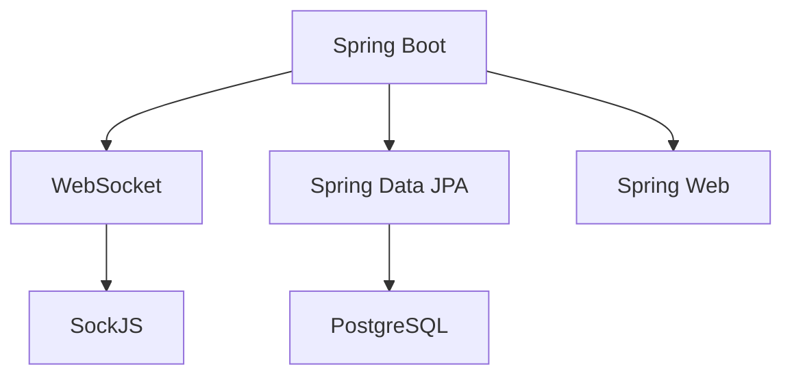

Here's a beautiful GitHub README with visual elements for your portfolio project:

# 🎟️ Ticket Management System - Backend


[](https://java.com)
[](https://spring.io)
[](https://docs.spring.io/spring-framework/docs/current/reference/html/web.html#websocket)
[](https://www.postgresql.org)

A high-performance backend system for managing ticket distribution with real-time WebSocket updates, perfect for event management applications.

## ✨ Key Features

<div align="center">
  
</div>

| Feature | Description |
|---------|-------------|
| ⚡ **Real-time Updates** | WebSocket integration for live ticket status notifications |
| 🏗️ **REST API** | Clean, well-structured endpoints for system management |
| ⚙️ **Dynamic Configuration** | Adjust ticket distribution parameters on-the-fly |
| ✉️ **Email Integration** | Automated notifications for important events |
| 🔒 **Secure** | CORS pre-configured for safe frontend integration |

## 🛠️ Technology Stack



## 🚀 Getting Started

### Prerequisites

- Java 17 JDK
- PostgreSQL 15+
- Maven 3.8+

### Installation

```bash
# Clone the repository
git clone https://github.com/yourusername/ticket-management-backend.git

# Navigate to project directory
cd ticket-management-backend

# Build the project
mvn clean install

# Run the application
java -jar target/backend-0.0.1-SNAPSHOT.jar
```

## 📚 API Documentation

### WebSocket Configuration
```java
@Configuration
@EnableWebSocketMessageBroker
public class WebSocketConfig implements WebSocketMessageBrokerConfigurer {
    @Override
    public void registerStompEndpoints(StompEndpointRegistry registry) {
        registry.addEndpoint("/ws")
                .setAllowedOrigins("http://localhost:5173")
                .withSockJS();
    }
    // ...
}
```

### REST Endpoints
| Endpoint | Method | Description |
|----------|--------|-------------|
| `/api/v1/customerstest/configure` | POST | Configure ticket distribution |

**Example Request:**
```json
{
  "id": 1,
  "customerName": "VIP Customer",
  "totalTicket": 1000,
  "ticketReleaseRate": 50,
  "customerRetrievalRate": 20,
  "maximumNumberOfTickets": 5
}
```

## 🏗️ Project Structure

```
backend/
├── src/
│   ├── main/
│   │   ├── java/
│   │   │   └── com/backend/backend/
│   │   │       ├── config/       # Configuration classes
│   │   │       ├── controller/   # API controllers
│   │   │       ├── dto/          # Data transfer objects
│   │   │       ├── entity/       # Database entities
│   │   │       ├── repo/         # Data repositories
│   │   │       └── service/      # Business logic
│   │   └── resources/            # Config files
├── pom.xml                       # Maven configuration
└── README.md                     # This file
```

## 🤝 Contributing

We welcome contributions! Please follow these steps:

1. Fork the project
2. Create your feature branch (`git checkout -b feature/AmazingFeature`)
3. Commit your changes (`git commit -m 'Add some AmazingFeature'`)
4. Push to the branch (`git push origin feature/AmazingFeature`)
5. Open a Pull Request

## 📄 License

Distributed under the MIT License. See `LICENSE` for more information.

## 📧 Contact

Your Name - [your.email@example.com](mailto:your.email@example.com)

Project Link: [https://github.com/yourusername/ticket-management-backend](https://github.com/yourusername/ticket-management-backend)

---

<div align="center">
  
  <p>Thank you for checking out my portfolio project!</p>
</div>

For the actual README:
1. Replace placeholder images with actual screenshots/diagrams
2. Update contact information and GitHub links
3. Add your own logo if available
4. Consider adding a demo video/gif if applicable

The markdown includes:
- Visual badges
- Clean tables
- Mermaid diagram
- Organized sections
- Emoji visual cues
- Placeholder images (replace with actual ones)
- Clear structure for portfolio presentation
