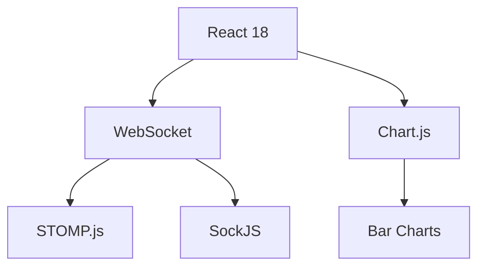

Here's a beautiful GitHub README with visual elements for your portfolio project:

# 🎟️ Ticket Management System - Backend


[](https://java.com)
[](https://spring.io)
[](https://docs.spring.io/spring-framework/docs/current/reference/html/web.html#websocket)
[](https://www.postgresql.org)

A high-performance backend system for managing ticket distribution with real-time WebSocket updates, perfect for event management applications.

## ✨ Key Features

<div align="center">
  
</div>

| Feature | Description |
|---------|-------------|
| ⚡ **Real-time Updates** | WebSocket integration for live ticket status notifications |
| 🏗️ **REST API** | Clean, well-structured endpoints for system management |
| ⚙️ **Dynamic Configuration** | Adjust ticket distribution parameters on-the-fly |
| ✉️ **Email Integration** | Automated notifications for important events |
| 🔒 **Secure** | CORS pre-configured for safe frontend integration |

## 🛠️ Technology Stack


## 🚀 Getting Started

### Prerequisites

- Java 17 JDK
- PostgreSQL 15+
- Maven 3.8+

### Installation

```bash
# Clone the repository
git clone https://github.com/yourusername/ticket-management-backend.git

# Navigate to project directory
cd ticket-management-backend

# Build the project
mvn clean install

# Run the application
java -jar target/backend-0.0.1-SNAPSHOT.jar
```

## 📚 API Documentation

### WebSocket Configuration
```java
@Configuration
@EnableWebSocketMessageBroker
public class WebSocketConfig implements WebSocketMessageBrokerConfigurer {
    @Override
    public void registerStompEndpoints(StompEndpointRegistry registry) {
        registry.addEndpoint("/ws")
                .setAllowedOrigins("http://localhost:5173")
                .withSockJS();
    }
    // ...
}
```

### REST Endpoints
| Endpoint | Method | Description |
|----------|--------|-------------|
| `/api/v1/customerstest/configure` | POST | Configure ticket distribution |

**Example Request:**
```json
{
  "id": 1,
  "customerName": "VIP Customer",
  "totalTicket": 1000,
  "ticketReleaseRate": 50,
  "customerRetrievalRate": 20,
  "maximumNumberOfTickets": 5
}
```

## 🏗️ Project Structure

```
backend/
├── src/
│   ├── main/
│   │   ├── java/
│   │   │   └── com/backend/backend/
│   │   │       ├── config/       # Configuration classes
│   │   │       ├── controller/   # API controllers
│   │   │       ├── dto/          # Data transfer objects
│   │   │       ├── entity/       # Database entities
│   │   │       ├── repo/         # Data repositories
│   │   │       └── service/      # Business logic
│   │   └── resources/            # Config files
├── pom.xml                       # Maven configuration
└── README.md                     # This file
```

## 🤝 Contributing

We welcome contributions! Please follow these steps:

1. Fork the project
2. Create your feature branch (`git checkout -b feature/AmazingFeature`)
3. Commit your changes (`git commit -m 'Add some AmazingFeature'`)
4. Push to the branch (`git push origin feature/AmazingFeature`)
5. Open a Pull Request

## 📄 License

Distributed under the MIT License. See `LICENSE` for more information.

## 📧 Contact

Your Name - [your.email@example.com](mailto:your.email@example.com)

Project Link: [https://github.com/yourusername/ticket-management-backend](https://github.com/yourusername/ticket-management-backend)

---

<div align="center">
  
  <p>Thank you for checking out my portfolio project!</p>
</div>

For the actual README:
1. Replace placeholder images with actual screenshots/diagrams
2. Update contact information and GitHub links
3. Add your own logo if available
4. Consider adding a demo video/gif if applicable

The markdown includes:
- Visual badges
- Clean tables
- Mermaid diagram
- Organized sections
- Emoji visual cues
- Placeholder images (replace with actual ones)
- Clear structure for portfolio presentation


Here's a beautiful README.md file for your Ticket Management System frontend React application:

```markdown
# 🎟️ Ticket Management System - Frontend


[](https://reactjs.org/)
[](https://www.chartjs.org/)
[](https://stomp.github.io/)
[](https://github.com/sockjs/sockjs-client)

A dynamic React dashboard for real-time ticket management with WebSocket integration, animated charts, and form validation.

## ✨ Features

<div align="center">
  
</div>

| Feature | Description |
|---------|-------------|
| 📊 **Real-time Updates** | Live WebSocket connection with STOMP protocol |
| 📈 **Animated Charts** | Smooth transitions with Chart.js visualizations |
| 📝 **Form Validation** | Client-side validation for all input fields |
| 💬 **System Messages** | Real-time message display from backend |
| 🎨 **Responsive Design** | Adapts to different screen sizes |

## 🛠️ Technology Stack



## 🚀 Getting Started

### Prerequisites

- Node.js 16+
- npm 8+
- Backend server running (see backend README)

### Installation

```bash
# Clone the repository
git clone https://github.com/yourusername/ticket-management-frontend.git

# Navigate to project directory
cd ticket-management-frontend

# Install dependencies
npm install

# Start the development server
npm start
```

## 🏗️ Project Structure

```
src/
├── components/
│   ├── Hero/               # Main dashboard component
│   │   ├── Hero.js         # Dashboard logic
│   │   └── Hero.css        # Dashboard styles
│   └── Navbar/            # Navigation component
│       ├── Navbar.js       # Navbar logic
│       └── Navbar.css      # Navbar styles
├── App.js                 # Root component
└── index.js               # Application entry point
```

## 📊 Component Highlights

### WebSocket Connection
```javascript
useEffect(() => {
  const stompClient = new Client({
    webSocketFactory: () => new SockJS(socketURL),
    reconnectDelay: 5000,
    debug: (str) => console.log(str),
  });

  stompClient.onConnect = () => {
    stompClient.subscribe('/topic/ticketUpdates', (message) => {
      const update = JSON.parse(message.body);
      setTicketUpdates(prev => ({
        totalTickets: update.totalTickets || prev.totalTickets,
        // ...other updates
      }));
    });
  };
  
  stompClient.activate();
  return () => stompClient.deactivate();
}, []);
```

### Animated Chart
```javascript
const chartData = {
  labels: ['Tickets'],
  datasets: [
    {
      label: 'Total Tickets',
      data: [currentTicketValues.totalTickets],
      backgroundColor: 'rgba(75, 192, 192, 0.6)',
    },
    // ...other datasets
  ]
};

<Bar data={chartData} options={{
  animation: {
    duration: 500,
    easing: 'easeOutQuart'
  }
}} />
```

### Form Validation
```javascript
const handleChange = (e) => {
  const { name, value } = e.target;
  
  // Integer validation
  if (['id', 'totalTicket'].includes(name)) {
    if (!/^\d*$/.test(value)) {
      setErrors(prev => ({...prev, integers: `${name} must be an integer`}));
      return;
    }
  }
  
  // Name validation
  if (name === 'customerName' && !/^[a-zA-Z\s]*$/.test(value)) {
    setErrors(prev => ({...prev, customerName: 'Letters and spaces only'}));
    return;
  }
  
  setFormData(prev => ({...prev, [name]: value}));
};
```

## 🎨 CSS Structure

The application uses modular CSS with:
- Responsive grid layouts
- Animated transitions
- Error state styling
- Card-based components

## 🤝 Contributing

Contributions are welcome! Please follow these steps:

1. Fork the repository
2. Create your feature branch (`git checkout -b feature/AmazingFeature`)
3. Commit your changes (`git commit -m 'Add some AmazingFeature'`)
4. Push to the branch (`git push origin feature/AmazingFeature`)
5. Open a Pull Request

## 📄 License

Distributed under the MIT License.

## 📧 Contact

Your Name - [your.email@example.com](mailto:your.email@example.com)

Project Link: [https://github.com/yourusername/ticket-management-frontend](https://github.com/yourusername/ticket-management-frontend)

---

<div align="center">
  
  <p>Dynamic Ticket Management Dashboard</p>
</div>
```

For the actual implementation:
1. Replace placeholder images with actual screenshots
2. Update the contact information and GitHub links
3. Add any additional features or components
4. Include a demo GIF/video if available
5. Add deployment instructions if applicable

The README includes:
- Visual badges
- Feature table
- Technology diagram
- Code snippets
- Clean project structure
- Contribution guidelines
- Responsive design notes
